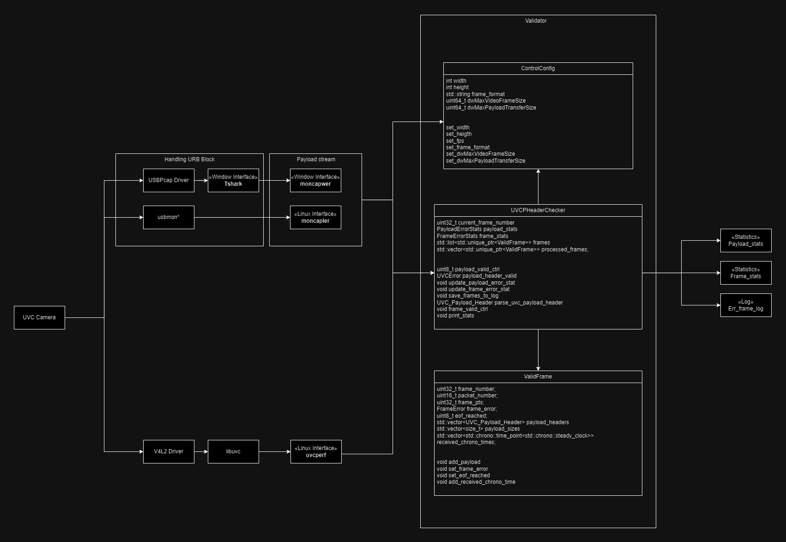

# uvc_frame_detector

version 0.2.0
included linux and window verison  
each using usbmon and tshark for stream  

## Usage

### In Window  
(only cmd works, not ps1, open in dev mode if possible)  
in ps1, put "cmd /c" at the start of command  
To run this code in window, must install wireshark in computer with USBPcap  
If USBPcap is not installed with Wireshark, reinstall wireshark and check USBPcap install  
After install, reboot  
C:\Program Files\Wireshark  
Find Wireshark.exe > go to Help(H) > Wireshark info(A) > Folder  
Check if Extcap Path is set extcap/wireshark  
If so go to C:\Program Files\Wireshark\extcap and move USBPcapCMD.exe to wireshark directory   

### Build
0. mkdir log
1. mkdir build
2. cd build
3. cmake ..
4. cmake --build .
5. cd Debug

### Run  
  
Go to project Directory  
0. cd build  

For both BULK & ISO & CTRL  
"C:\Program Files\Wireshark\tshark" -i \\.\USBPcap1 -T fields -e usb.transfer_type -e frame.time_epoch -e frame.len -e usb.capdata -e usb.iso.data -e usbvideo.format.index -e usbvideo.frame.index -e usbvideo.frame.width -e usbvideo.frame.height -e usbvideo.streaming.descriptorSubType -e usbvideo.frame.interval -e usbvideo.probe.maxVideoFrameSize -e usbvideo.probe.maxPayloadTransferSize -E separator=; -Y "usb.device_address == 3" -Q | .\debug\oldmanandsea.exe  
  

  
If want to force the format then type down below...  
Can find maximum frame size and maximum payload size in  
for Window > download usb device tree viewer and check video streaming format type descriptor: dwMaxVideoFrameBufferSize
for linux type lsusb -v and find dwMaxVideoFrameBufferSize  
if leave blank for -fw -fh -fps -ff -mf -mp, everything will be set automatically  
each indicate frame_width frame_height frame_per_sec frame_format max_frame_size max_payload_size  

-e usb.transfer_type -e frame.time_epoch -e frame.len -e usb.iso.data // Must be in correct order  
if you are in build directory, can change C:\\-----PROJECT_DIRECTORY_PATH-----\build into .\Debug\oldmanandsea.exe  

### In LINUX

### Build
0. sudo modprobe usbmon
1. mkdir log
2. mkdir build
3. cd build
4. cmake ..
5. make

### Run 
0. cd build
1. lsusb  
Bus 001 Device 001: ID 1d6b:0002 Linux Foundation 2.0 root hub  
Bus 001 Device 002: ID 80ee:0021 VirtualBox USB Tablet  
Bus 001 Device 004: ID 2e1a:4c01 Insta360 Insta360 Link  
Bus 001 Device 005: ID 046d:085e Logitech, Inc. BRIO Ultra HD Webcam  
Bus 002 Device 001: ID 1d6b:0003 Linux Foundation 3.0 root hub  
2. sudo ./uvc_frame_detector -in usbmon1 -bs 41536 -bn 1 -dn 4 -fw 1280 -fh 720 -fps 30 -ff mjpeg -mf 16777216 -v 2 -lv 1  

-interface  
usbmon0 for all usb transfers, usbmon1 only for usb bus 1, usbmon2 only for usb bus 2 ... 
-bus number, device number  
can find by lsusb  
-frame width, frame height, frame per second, frame format  
needs to be designated by user  
some of the tests will not be played  
currently auto set to 1280x720  
-verbose, verbose log 
setting up levels of printings in screen and log 

3. run any camera appliation, guvcview, cheese, vlc, opencv ... e.g.) guvcview

### See Usage
0. sudo ./moncapler

### Example without camera
0. ./example
To test validation algorithm, can test with colour bar screen of jpeg 
Build with cmake above 

### Test Codes
0. ./valid_test
Build with cmake above 

## How It Works

It brings the data of the usbmon (usbmonitor) 
So you will have to choose which usbmon to use 
And then it filters the data by looking at urb header and find specific device's urb 
When it is found, devide them into IN OUT, CONTROL BULK ISO 
And recombine urb block with each algorithms to have complete transfer data, 
starting with payload header 
Then another thread validate the transferred data by looking at the headers 
When validation is finished, transfers are combined into a frame 
When it is done, fps are calculated and shows whether frame has errors 
Error statistics will be given 
Below is one of them  

### Example Result

### For window & linux

press ctrl + c once to see statistics  

UVCPHeaderChecker Destructor  
Payload Error Statistics:  
No Error: 1064 (99.2537%)  
Empty Payload: 0 (0%)  
Max Payload Overflow: 0 (0%)  
Error Bit Set: 3 (0.279851%)  
Length Out of Range: 1 (0.0932836%)  
Length Invalid: 0 (0%)  
Reserved Bit Set: 0 (0%)  
End of Header Bit: 0 (0%)  
Toggle Bit Overlapped: 0 (0%)  
Frame Identifier Mismatch: 4 (0.373134%)  
Swap: 0 (0%)  
Missing EOF: 0 (0%)  
Unknown Error: 0 (0%)  
  
Frame Error Statistics:  
No Error: 1064 (94.1593%)  
Frame Drop: 66 (5.84071%)  
Frame Error: 0 (0%)  
Max Frame Overflow: 0 (0%)  
Invalid YUYV Raw Size: 0 (0%)  
Same Different PTS: 0 (0%)  
Exiting safely...  
End of main  

### For Linux only

Capture Statistics: 
  
Total Packets received in usbmon: 6982 
Total Packets dropped by system buffer: 10122 
Total Packets dropped by interface: 0 
  
Total Packets counted in usbmon by application: 6952 
Total Packet Length bytes: 40249996 
Total Captured Packet Length bytes: 40249996 
  
Filtered Packets (busnum=1, devnum=4): 6940 
Filtered Packet Length bytes (busnum=1, devnum=4): 40249115 
Filtered Captured Packet Length bytes (busnum=1, devnum=4): 40249115 
  
  
If Filtered Packet Length bytes and Filtered Captured Packet Length bytes are different, then test enviroment is maybe unstable  
Starting camera after running code may cause difference in this value, ignore it if think unnecessary  
  
### Saved log file
To compare raw data with result, go to log dir 

frames_log.txt can see every frame packets information  

### Test Codes
valid_tests  
frame_tests  
all tests passed 100  

test_packaet_handler is also available for linux  

# uvcperf

Modified Libuvc stream file to get the live stream from the camera and validate the data at the final stage  

## Usage
Same building method written above  
Changed libuvc streaming part and made valiate statistics for streaming  
ONLY ON LINUX environment  

## RUN
0. cd build
1. sudo ./uvcperf  
ctrl + c to end  

# UML Diagram

### TODO
make jpeg data into .jpeg file to see the err frame  
