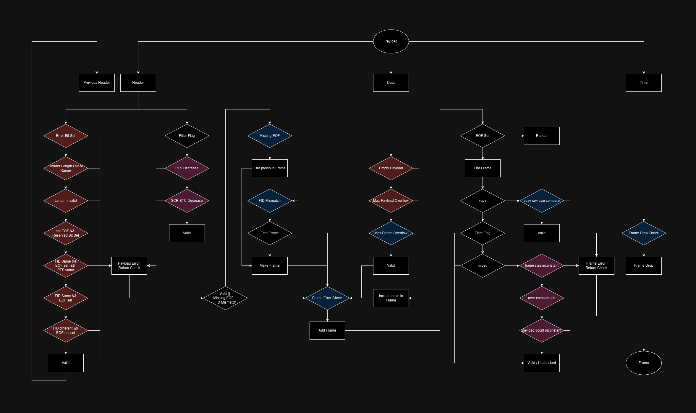
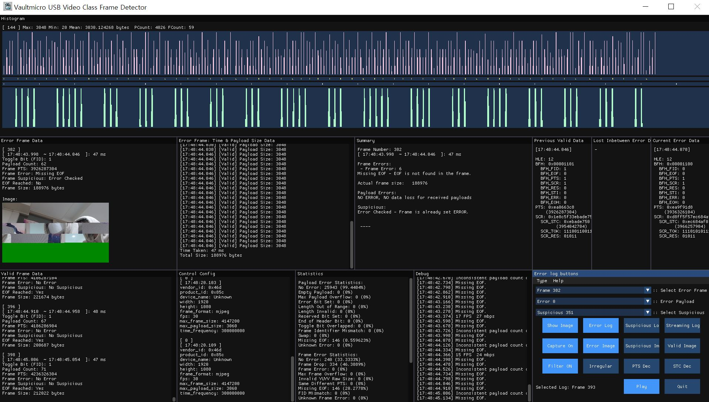
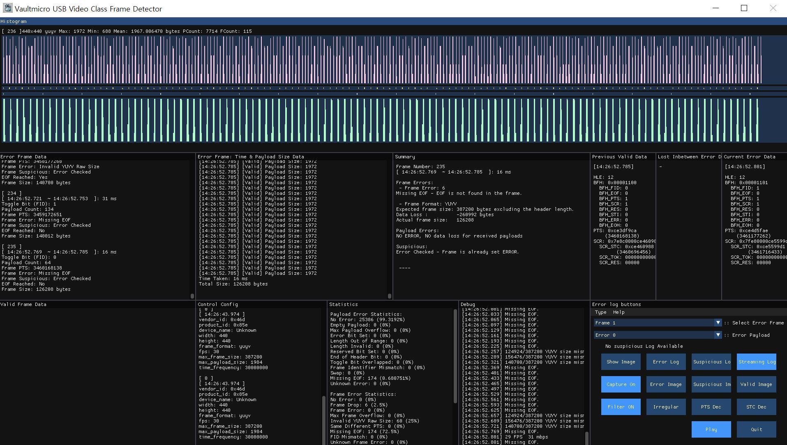

# UVC Frame Detector (uvc_frame_detector)

version 1.0.0
New method for Graphs.  
New feature included, graph scale and start of frame checker.  
New Documents in documents/Usb Video Class Frame Detector.pdf

---

## Overview
The UVC Frame Detector (UVCFD) analyzes USB video frames by capturing data, validating headers, and detecting errors in payloads and frames. It supports live camera streams and pre-recorded `pcapng` files.

### Key Features:
- Real-time analysis of USB video data.
- Validation and error detection for payloads and frames.
- Comprehensive error statistics.
---

## Executable Files

### Main Project :  
### UVCFD (UVC Frame Detector)  
This programme uses pipeline with tshark gets parsed data, recombine urb into payloads and frames.  
Detects invalid datas and payload headers, frames.  
Shows error data, stats. _t stands for tui, _g stands for gui.  
Can use live stream using camera application
Or can use pcapng file 

in window using camera application  
  ```
.\run_uvcfd.ps1  
  ```

in window using pcapng  
  ```
.\run_uvcfdp.ps1  
  ```

in linux  
  ```
./run_uvcfd.bash
  ```
  
</br>
</br>

### Side Projects:
### Moncapler
This programme uses usbmon* in linux to get raw data, recombine urb into payloads and frames.  
Uses same validation with oldmanandsea, however controlconfig data is not yet programmed.  

### UVCPerf
This programme uses usbmon* in linux to get raw data live, recombine urb into payloads and frames.  
Uses same validation with oldmanandsea & Moncapler, however controlconfig data is not yet programmed.  

### Valid_test, Frame_test_iso, Frame_test_bulk, Example  
Uses captured raw log data to test whether validation for payload and frame is well made.  
Google test is used to test each unit, and linux urb is used as an example (but can run in window).  

### Log_test, Log_test_g
Gets txt file from wireshark, File>Export Packet Dissections>As Plain Text>Details: All expanded  
Use tests/change_shark/shkwhl_b for bulk shkwhl_i for iso  
And modify the log_test code to find designate txt file, run. _t stands for tui, _g stands for gui  
Auto controlconfig is not programmed.  

### Test_packet_handler
Can build and run in linux only, tests moncapler whether it has combined urb blocks into valid frames.  


## Usage

### In Window  
(only cmd works, not ps1, open in dev mode if possible)  
in ps1, put "cmd /c" at the start of command  
To run this code in window, must install wireshark in computer with USBPcap  
If USBPcap is not installed with Wireshark, reinstall wireshark and check USBPcap install  
After install, reboot  
C:\Program Files\Wireshark  
Find Wireshark.exe > go to Help(H) > Wireshark info(A) > Folder  
Check if Extcap Path is set extcap/wireshark  
If so go to C:\Program Files\Wireshark\extcap and move USBPcapCMD.exe to wireshark directory   


### Build
0. mkdir images
1. mkdir build
2. cd build
3. Configure the build system using CMake:
- For Debug build:
  ```
  cmake -DCMAKE_BUILD_TYPE=Debug ..
  ```
- For Release build:
  ```
  cmake -DCMAKE_BUILD_TYPE=Release ..
  ```
4. Configure the build system using CMake:
- For Debug build:
  ```
  cmake --build . --config Debug
  ```
- For Release build:
  ```
  cmake --build . --config Release
  ```
5. cd Debug/Release  

### Compiler info  
```
-- Building for: Visual Studio 17 2022  
-- Selecting Windows SDK version 10.0.26100.0 to target Windows 10.0.19045.  
-- The CXX compiler identification is MSVC 19.41.34120.0  
-- The C compiler identification is MSVC 19.41.34120.0  
```


### Run  
  
Use the shellscript given.
```
0. .\run_uvcfd.ps1
```
 Use the shellscript given. Make sure the library packages are installed.   
 The Wireshark program needs to be installed at the Program Files directory with USBPcapCMD.  
 If not, change the shellscript path. But DO NOT Edit the Fields Data or its Sequence.  
 Make sure the uvcfd.exe correctly path, or edit the shellscript.  


If want to force the format then type down below...  
Can find maximum frame size and maximum payload size in  
for Window > download usb device tree viewer and check video streaming format type descriptor: dwMaxVideoFrameBufferSize
for linux type lsusb -v and find dwMaxVideoFrameBufferSize  
if leave blank for -fw -fh -fps -ff -mf -mp, everything will be set automatically  
each indicate frame_width frame_height frame_per_sec frame_format max_frame_size max_payload_size  

-e usb.transfer_type -e frame.time_epoch -e frame.len -e usb.iso.data // Must be in correct order  
if you are in build directory, can change C:\\-----PROJECT_DIRECTORY_PATH-----\build into .\Debug\oldmanandsea.exe  


### Example without camera
0. ./example
To test validation algorithm, can test with colour bar screen of jpeg<br/>
Build with cmake above<br/>

### Test Codes
0. ./valid_test
Build with cmake above<br/>

## How It Works

And then it filters the data by looking at urb header and find specific device's urb<br/>
When it is found, devide them into in out, control bulk iso<br/>
And recombine urb block with each algorithms to have complete transfer data,<br/>
starting with payload header<br/>
Then another thread validate the transferred data by looking at the headers<br/>
When validation is finished, transfers are combined into a frame<br/>
When it is done, fps are calculated and shows whether frame has errors<br/>
Error statistics will be given<br/>



# UML Diagram


# Example




