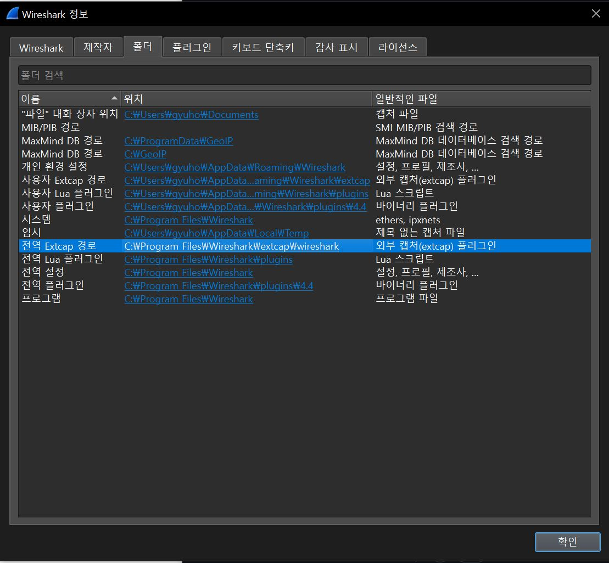
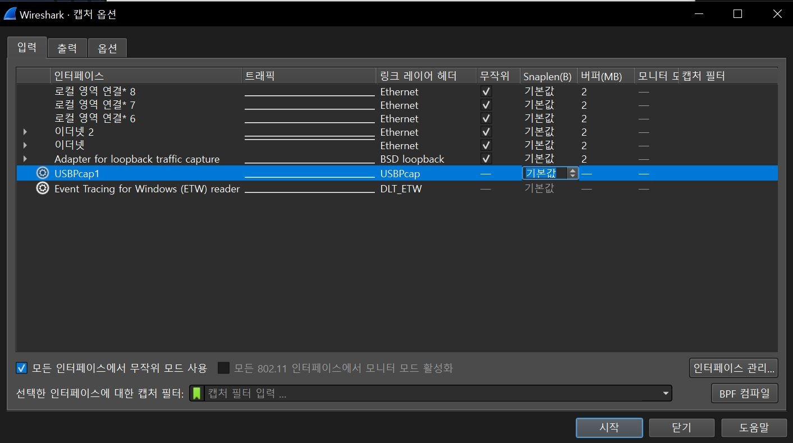
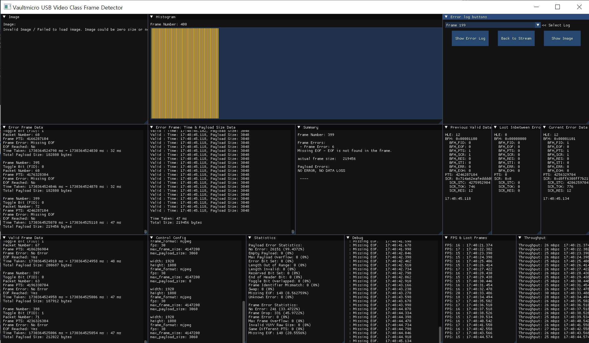
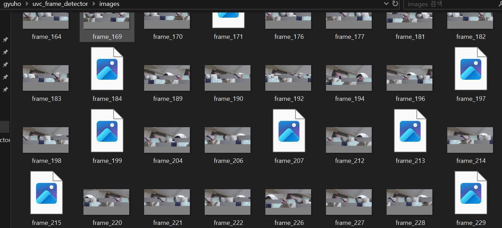

# If have any Problem when running the programme, please check out some of the solutions below  

# Unable to capture Streaming Datas

In Windows, please check if USBPcapCMD is in the correct directory.
The path C:\Program Files\Wireshark\extcap\wireshark might not be one of the settings.
Can check extcap setting in Wireshark > Help > Wireshark Info > Folders > Extcap path  
If USBPcapCMD is not there, relocate it.  
If USBPcapCMD is not found, may need to reinstall Wireshark and ensure USBPcap is downloaded.

# All frames are invalid

All of the datas could be seen as failed frames.  
Please check that there is '-s 0' format when using the tshark.  
Or when using pcapng file, you must set snap len to sufficiently high number so data may not truncated while receiving it.  
## Can check this information on Wireshark > Capture > Option > Sanplen

# Images not shown properly
  
May have seen Invalid Image / Failed to load images. Image could be zero size or not found.  
There can be three possible situations.

1. images directory is not made
Make sure there is images directory in the place you are running the programme.  
Or images will not be saved like below.  

2. zero length data or wrong header format is been received  
Image file is made but can not open since there is no data.  
You can check raw data file by xxd or hxd.  

3. image is not created  
Image could not be made for some reason.  
Currently h.264 format is not provided.  
Or somewhat error may cause from developing frame image.  
If this keep happen this could be programme error.  

  

# Unable to Quit

Press ctrl + C in the terminal window that is executing oldmanandsea_g, NOT Vaultmicro USB Frame Detector.  
And wait for a while after all of the streaming data has been handled in the programme.  